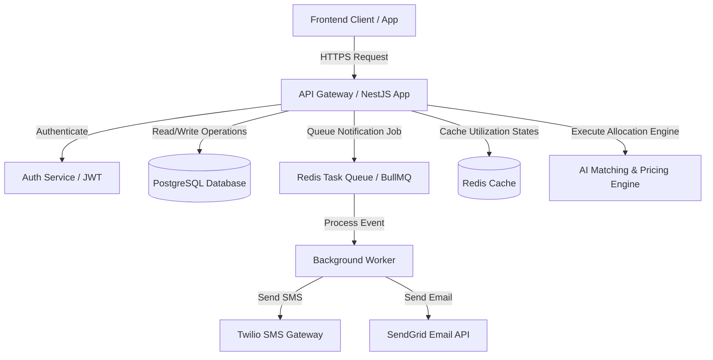

# Backend Architecture Guide - Reserva AI

This document details the backend architectural design, database schemas, and system integration patterns for building a production-ready version of the **Reserva AI** platform.

---

## 🏗️ System Architecture Overview

Reserva AI utilizes an event-driven, microservices-ready structure to handle high-concurrency booking actions, dynamic pricing checks, and background worker queues.



### Key Technologies Recommended
- **API Runtime**: Node.js (TypeScript) with **NestJS** or **Express.js** for robust controller structures.
- **Primary Database**: **PostgreSQL** to handle strict relational constraints (linking staff, resources, and slots).
- **Caching & Queue Storage**: **Redis** for sub-millisecond capacity checks and job staging.
- **Queue Processor**: **BullMQ** to process automated SMS/email reminders asynchronously.
- **Provider Services**: **Twilio** for SMS, **ResGrid/SendGrid** for emails, and **Stripe** for payment processing.

---

## 🗄️ Database Schemas (PostgreSQL DDL)

Here are the primary SQL tables designed to manage staff schedules, resource reservations, and dynamic pricing rules.

```sql
-- 1. Users & Accounts Table
CREATE TABLE users (
    id UUID PRIMARY KEY DEFAULT gen_random_uuid(),
    email VARCHAR(255) UNIQUE NOT NULL,
    password_hash VARCHAR(255) NOT NULL,
    name VARCHAR(100) NOT NULL,
    role VARCHAR(50) DEFAULT 'client', -- 'client', 'staff', 'admin'
    created_at TIMESTAMP WITH TIME ZONE DEFAULT CURRENT_TIMESTAMP
);

-- 2. Staff Profiles & Credentials Table
CREATE TABLE staff (
    id UUID PRIMARY KEY DEFAULT gen_random_uuid(),
    user_id UUID REFERENCES users(id) ON DELETE SET NULL,
    name VARCHAR(100) NOT NULL,
    specialties TEXT[] NOT NULL, -- Array of skills, e.g., {'Radiologist', 'Consultant'}
    workload_weekly_cap INT DEFAULT 40, -- Maximum working hours per week
    availability_calendar JSONB NOT NULL -- Working hours, e.g., {"Monday": ["09:00-17:00"]}
);

-- 3. Shared Resources (Rooms, Vehicles, Courts) Table
CREATE TABLE resources (
    id UUID PRIMARY KEY DEFAULT gen_random_uuid(),
    name VARCHAR(100) NOT NULL,
    type VARCHAR(50) NOT NULL, -- 'room', 'vehicle', 'court', 'equipment'
    capacity INT DEFAULT 1,
    current_occupancy INT DEFAULT 0,
    utilization_rate DECIMAL(5,2) DEFAULT 0.00
);

-- 4. Dynamic Pricing Rules Table
CREATE TABLE price_rules (
    id UUID PRIMARY KEY DEFAULT gen_random_uuid(),
    service_type VARCHAR(100) NOT NULL,
    base_price DECIMAL(10,2) NOT NULL,
    occupancy_threshold DECIMAL(5,2) NOT NULL, -- Trigger pricing when resource utilization exceeds this (e.g. 0.80 for 80%)
    peak_multiplier DECIMAL(3,2) NOT NULL -- Price multiplier (e.g. 1.25 for +25%)
);

-- 5. Bookings & Reservations Core Table
CREATE TABLE bookings (
    id UUID PRIMARY KEY DEFAULT gen_random_uuid(),
    client_id UUID REFERENCES users(id) ON DELETE SET NULL,
    client_name VARCHAR(100) NOT NULL,
    service_type VARCHAR(100) NOT NULL,
    staff_id UUID REFERENCES staff(id) ON DELETE SET NULL,
    resource_id UUID REFERENCES resources(id) ON DELETE SET NULL,
    scheduled_at TIMESTAMP WITH TIME ZONE NOT NULL,
    duration_minutes INT DEFAULT 60,
    base_price DECIMAL(10,2) NOT NULL,
    dynamic_price DECIMAL(10,2) NOT NULL,
    status VARCHAR(50) DEFAULT 'confirmed', -- 'pending', 'confirmed', 'completed', 'cancelled'
    created_at TIMESTAMP WITH TIME ZONE DEFAULT CURRENT_TIMESTAMP
);
```

---

## 🔌 API Endpoint Specifications

### 1. Authentication Endpoints

#### Register Account
- **POST** `/api/auth/register`
- **Request Body**:
  ```json
  {
    "name": "Alex Rivera",
    "email": "alex@company.com",
    "password": "securepassword123"
  }
  ```
- **Response** (`201 Created`):
  ```json
  {
    "message": "User registered successfully.",
    "user": { "id": "uuid-string", "name": "Alex Rivera", "email": "alex@company.com" }
  }
  ```

#### Authenticate Login
- **POST** `/api/auth/login`
- **Request Body**:
  ```json
  {
    "email": "alex@company.com",
    "password": "securepassword123"
  }
  ```
- **Response** (`200 OK`):
  ```json
  {
    "message": "Login successful.",
    "token": "eyJhbGciOiJIUzI1NiIsInR5cCI6IkpXVCJ9...",
    "user": { "id": "uuid-string", "name": "Alex Rivera" }
  }
  ```

---

### 2. Intelligent Booking Pipeline Endpoints

#### Get Live Pricing Estimate
- **POST** `/api/booking/pricing`
- **Description**: Dynamically calculates estimated rates depending on time-slots and real-time resource utilization.
- **Request Body**:
  ```json
  {
    "serviceType": "service-mri",
    "preferredTime": "2026-07-07T12:00:00Z"
  }
  ```
- **Response** (`200 OK`):
  ```json
  {
    "basePrice": 250.00,
    "utilizationRate": 0.85,
    "peakMultiplier": 1.18,
    "finalPrice": 295.00
  }
  ```

#### Allocate & Confirm Booking
- **POST** `/api/booking/create`
- **Description**: Runs transaction locks on resource/staff tables, commits booking, and queue SMS reminder notification.
- **Request Headers**: `Authorization: Bearer <JWT_TOKEN>`
- **Request Body**:
  ```json
  {
    "clientName": "Alex Rivera",
    "serviceType": "service-mri",
    "preferredTime": "2026-07-07T09:00:00Z"
  }
  ```
- **Response** (`201 Created`):
  ```json
  {
    "bookingId": "booking-uuid",
    "status": "confirmed",
    "assignedStaff": "Dr. Sarah Jenkins",
    "assignedResource": "MRI Suite 4",
    "finalPrice": 295.00,
    "smsStatus": "queued"
  }
  ```

---

## ⚙️ AI Allocation Logic Flow

When a booking request comes in, the backend performs the following steps inside a transaction block:

1. **Verify Asset (Resource)**: Queries the `resources` table for the required type (e.g. MRI machine, private dining room) to verify it is unoccupied at the requested timestamp.
2. **Filter Staff (Availability & Skill)**: Searches the `staff` table to match who has the correct specialty AND has a free schedule matching the workload limit criteria.
3. **Calculate Dynamic Pricing**: Queries current active session occupancy metrics. If utilization for this resource type is above `80%` for this time-block, apply `1.18x` peak multiplier.
4. **Acquire Locks & Commit**: Creates row locks on the resource and staff slot to prevent double-booking. Saves record to `bookings` table.
5. **Stage Alert Job**: Pushes a reminder task into the Redis Queue (`BullMQ`) with a delayed release configuration (e.g. triggers SMS send task 24 hours prior to appointment).
